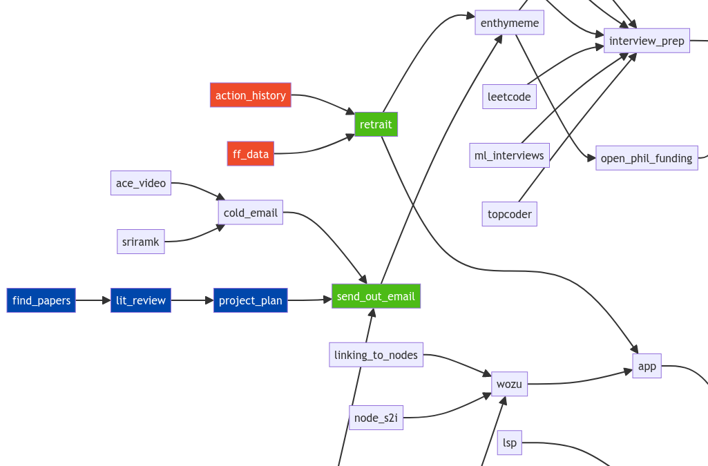

# Wozu 🤔

Manage a project, develop a recipe, organize your inner thoughts, or plan a party with Wozu.

## Basic concept

Everything in life is composed of tasks that depend on one another.

Therefore, in Wozu you can do three things:

- Link tasks together
- Focus on tasks (Kanban)
- Embed URLs in tasks

This simple feature set encourages fast iteration and the exploration of ideas, not tooling.

## How to use

1. Fill out:
   
|File|Example|
|---|---|
|`graph.txt`|`a --> b` `b --> c`|
|`todo.txt`|`Want to do:` (green) `c` `Will do:` (blue) `b` `Doing:` (red) `a`|
|`links.txt`|`a: somesite.com.com/someplace`|

2. Run `python server.py` to start the UI.
3. Iterate to see changes rendered immediately.

## Some tips

- Adjust until the graph looks pretty. This will force you to draw useful connections.
- Use separate files to track different things, or put everything in one big graph.
- You can use version control (Git) to back up your changes!
- You can embed graphs within each other. [TODO]

## On the name

Wozu is German for "for what", or "in order to." 

The name seems fitting as all tasks are "for" something else. 

Plus I like the sound (woe-tsu).
