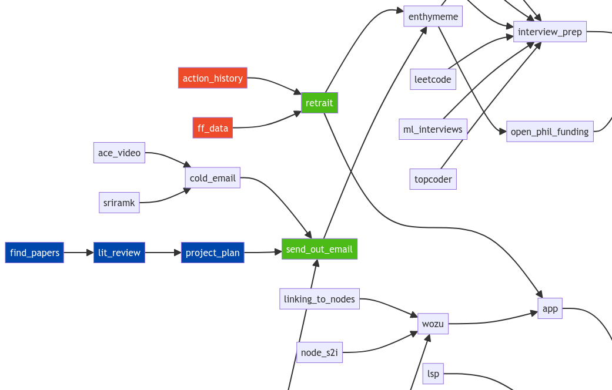

# Wozu
Stay organized by representing your work as a _graph_. This approach helps you stay focused and discover relationships between tasks.

# How to use
|File|Description|
|---|---|
|`graph.txt`|Chain task A to task B by writing `a --> b`.|
|`todo.txt`|Color-code nodes under the headers `Want to do` (green), `Will do` (blue), and `Doing` (red).|
|`links.txt`|Writing `a: somewebsite.com/link` will create a hyperlink for node A.|

1. Fill out these files.
2. Run `python server.py` to open a tab you can keep pinned in your browser.
3. Modify the text files to see changes rendered immediately!

**Use this workflow to explore connections between nodes and discover the shape your own system!**
